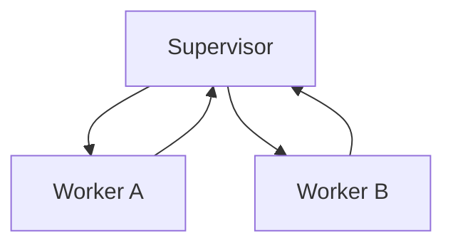

# Presets

Presets are pre-configured workflows for common development patterns. They save you from writing hat configurations from scratch.

## Using Presets

```bash
# List all presets
ralph init --list-presets

# Initialize with a preset
ralph init --preset tdd-red-green

# Combine with backend
ralph init --preset spec-driven --backend kiro

# Overwrite existing config
ralph init --preset debug --force
```

## Available Presets

### Development Workflows

#### feature

Standard feature development with planning and building.

```bash
ralph init --preset feature
```

**Hats:** Planner → Builder
**Best for:** General feature implementation

#### feature-minimal

Single-hat minimal implementation.

```bash
ralph init --preset feature-minimal
```

**Hats:** Single Builder
**Best for:** Simple tasks, quick prototyping

#### tdd-red-green

Test-Driven Development with red-green-refactor cycle.

```bash
ralph init --preset tdd-red-green
```

**Hats:** Tester → Implementer → Refactorer
**Best for:** Quality-focused development, well-tested code

#### spec-driven

Specification-first development.

```bash
ralph init --preset spec-driven
```

**Hats:** Spec Writer → Builder → Verifier
**Best for:** Complex features with clear requirements

#### refactor

Code refactoring workflow.

```bash
ralph init --preset refactor
```

**Hats:** Analyzer → Planner → Executor
**Best for:** Large refactors, technical debt cleanup

### Debugging & Investigation

#### debug

Bug investigation and fixing.

```bash
ralph init --preset debug
```

**Hats:** Investigator → Fixer → Verifier
**Best for:** Bug hunting, issue resolution

#### incident-response

Production incident handling.

```bash
ralph init --preset incident-response
```

**Hats:** Triage → Fixer → Postmortem
**Best for:** Production issues, urgent fixes

#### code-archaeology

Legacy code understanding.

```bash
ralph init --preset code-archaeology
```

**Hats:** Explorer → Documenter → Presenter
**Best for:** Understanding unfamiliar code

### Review & Quality

#### review

Code review workflow.

```bash
ralph init --preset review
```

**Hats:** Analyzer → Critic → Suggester
**Best for:** PR reviews, code quality checks

#### pr-review

Multi-perspective PR review.

```bash
ralph init --preset pr-review
```

**Hats:** Security Reviewer → Performance Reviewer → Style Reviewer
**Best for:** Comprehensive PR reviews

#### adversarial-review

Devil's advocate review style.

```bash
ralph init --preset adversarial-review
```

**Hats:** Critic → Defender → Judge
**Best for:** Security reviews, critical code

### Documentation

#### docs

Documentation writing workflow.

```bash
ralph init --preset docs
```

**Hats:** Writer → Reviewer → Publisher
**Best for:** Creating documentation

#### documentation-first

Doc-first development.

```bash
ralph init --preset documentation-first
```

**Hats:** Doc Writer → Implementer → Syncer
**Best for:** API design, contract-first development

### Specialized

#### api-design

API-first development.

```bash
ralph init --preset api-design
```

**Hats:** Designer → Implementer → Documenter
**Best for:** REST APIs, GraphQL schemas

#### migration-safety

Safe code migrations.

```bash
ralph init --preset migration-safety
```

**Hats:** Analyzer → Migrator → Verifier
**Best for:** Framework upgrades, dependency updates

#### performance-optimization

Performance tuning workflow.

```bash
ralph init --preset performance-optimization
```

**Hats:** Profiler → Optimizer → Benchmarker
**Best for:** Performance improvements

#### scientific-method

Experimental approach to problem-solving.

```bash
ralph init --preset scientific-method
```

**Hats:** Hypothesizer → Experimenter → Concluder
**Best for:** Unknown problems, exploration

#### mob-programming

Simulated mob programming.

```bash
ralph init --preset mob-programming
```

**Hats:** Driver → Navigator → Observer (rotating)
**Best for:** Complex problems, learning

#### socratic-learning

Learning through dialogue.

```bash
ralph init --preset socratic-learning
```

**Hats:** Questioner → Answerer → Synthesizer
**Best for:** Understanding complex topics

#### research

Research and analysis workflow.

```bash
ralph init --preset research
```

**Hats:** Gatherer → Analyzer → Synthesizer
**Best for:** Market research, technical investigation

#### gap-analysis

Compare current state vs target.

```bash
ralph init --preset gap-analysis
```

**Hats:** Current Analyzer → Target Definer → Gap Identifier
**Best for:** Audit, compliance, planning

#### confession-loop

Introspective Builder-Confessor-Handler cycle.

```bash
ralph init --preset confession-loop
```

**Hats:** Builder → Confessor → Handler
**Best for:** High-quality code with self-review

#### pdd-to-code-assist

Prompt-Driven Development flow.

```bash
ralph init --preset pdd-to-code-assist
```

**Hats:** Spec Writer → Code Assist
**Best for:** Structured development workflow

## Preset Patterns

### Pipeline

Linear A → B → C flow:


**Examples:** feature, tdd-red-green, docs

### Supervisor-Worker

Coordinator with specialists:



**Examples:** mob-programming, pr-review

### Critic-Actor

One proposes, another critiques:


**Examples:** adversarial-review, confession-loop

## Customizing Presets

After initializing with a preset, modify `ralph.yml`:

```yaml
# Start with preset
ralph init --preset tdd-red-green

# Edit ralph.yml to customize
hats:
  tester:
    instructions: |
      Custom instructions for your project...
```

## Creating Your Own Presets

Presets are stored in `/presets/`. Create a new one:

```yaml
# presets/my-workflow.yml
name: "My Workflow"
description: "Custom workflow for my team"

event_loop:
  starting_event: "task.start"
  completion_promise: "LOOP_COMPLETE"

hats:
  first_hat:
    triggers: ["task.start"]
    publishes: ["step.done"]
    instructions: "..."

  second_hat:
    triggers: ["step.done"]
    publishes: ["LOOP_COMPLETE"]
    instructions: "..."
```

Then use it:

```bash
ralph init --preset my-workflow
```

## Next Steps

- Learn about [Configuration](configuration.md) for full options
- Explore [Writing Prompts](prompts.md) for better results
- See [Creating Custom Hats](../advanced/custom-hats.md) for advanced workflows
